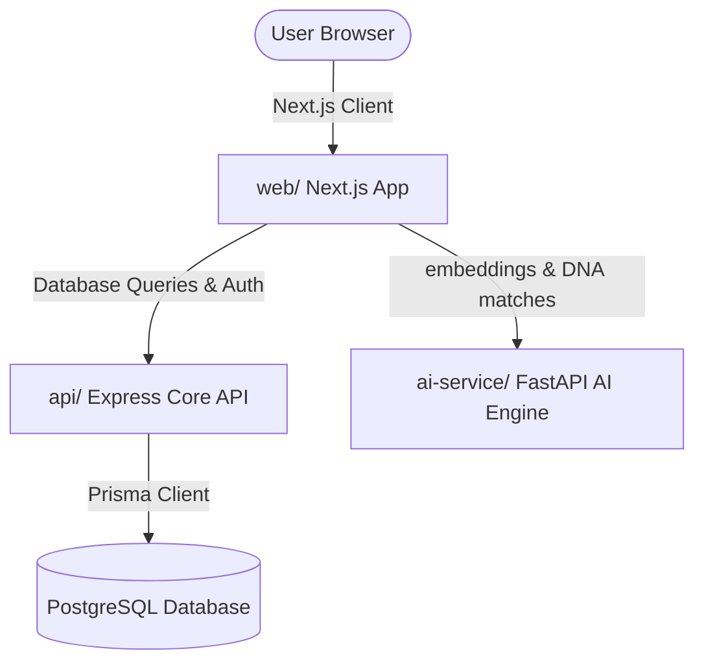

# 👔 LIVERY: Premium Fashion Discovery & AI Styling Platform

Welcome to **LIVERY**, a next-generation premium fashion ecommerce discovery platform powered by advanced AI recommendation engines and built with a modern, high-fidelity user interface.

This repository is structured as a robust **Monorepo** containing three distinct services: a Next.js web client, a Node/Express core API, and a FastAPI Python AI styling service.

---

## 🏗️ System Architecture



### 1. Frontend Web App (`/web`)
*   **Technologies:** Next.js 16.2.6 (App Router, Turbopack), Tailwind CSS v4, TypeScript, React 19.
*   **State & Animation:** Zustand (persistent state for cart, search, and user auth), Framer Motion, and GSAP (premium, smooth micro-interactions).
*   **Key Features:**
    *   **AI Stylist Interface:** Immersive styling consultant chat.
    *   **Collections Page:** Elegant visual layouts for curation.
    *   **Wishlist & Cart:** Fluid client-side shopping systems.
    *   **Waitlist:** High-conversion waitlist for early platform access.

### 2. Core Backend API (`/api`)
*   **Technologies:** Node.js, Express (TypeScript), Prisma ORM, Zod, JsonWebToken.
*   **Purpose:** Handles standard database queries, relational business logic, user registration, JWT token generation, and secure data access.
*   **Database:** PostgreSQL integration via Prisma Schema.

### 3. AI recommendation Service (`/ai-service`)
*   **Technologies:** Python, FastAPI, Sentence-Transformers, Uvicorn, NumPy.
*   **Purpose:** Computes semantic text embeddings for user searches and user "Style DNA" vectors using the pre-trained `all-MiniLM-L6-v2` transformer model to recommend fashion assets matching customer preferences.

---

## 📁 Repository Directory Layout

```
├── web/                   # Next.js Frontend Application
│   ├── src/
│   │   ├── app/           # App Router Pages & Layouts (cart, collections, discover...)
│   │   ├── components/    # Reusable UI Elements (glassmorphism buttons, cards...)
│   │   └── store/         # Zustand global client state management
│   └── package.json       # Frontend package definitions
│
├── api/                   # Node/Express Backend API
│   ├── src/               # Index and Express Route handlers
│   └── package.json       # Backend package definitions
│
├── ai-service/            # Python FastAPI AI Recommendation Engine
│   ├── main.py            # AI Engine endpoints and ML model loading
│   └── requirements.txt   # Python package dependencies
│
├── vercel.json            # Simplified Vercel Monorepo deployment settings
├── package.json           # Root package defining npm workspaces for Next.js builds
└── SECURITY.md            # Active local Security Guidelines and Checklist
```

---

## 🚀 How to Run Locally

### Prerequisites
*   **Node.js:** version 20.x or newer
*   **Python:** version 3.9 or newer

### 1. Running the Next.js Frontend (`/web`)
Open a terminal in the root directory and run:
```powershell
# 1. Install all dependencies across the workspace
npm install

# 2. Start the Next.js development server
npm run dev -w web
```
The client will be running at **`http://localhost:3000`**.

### 2. Running the Core Backend API (`/api`)
Open a new terminal window:
```powershell
cd api

# 1. Install dependencies
npm install

# 2. Run Prisma migrations (if database configured)
npx prisma db push

# 3. Start Express server in development mode
npm run dev
```
The API will be running at **`http://localhost:8000`**.

### 3. Running the AI Service (`/ai-service`)
Open a new terminal window:
```powershell
cd ai-service

# 1. Create a virtual environment (optional but recommended)
python -m venv venv
.\venv\Scripts\activate

# 2. Install Python dependencies
pip install -r requirements.txt

# 3. Start the FastAPI recommendation server
python main.py
```
The AI service will be running at **`http://localhost:8001`**.

---

## 🌐 Production Deployment

This monorepo is fully optimized to deploy seamlessly to **Vercel** with a single click.

1.  **Workspaces Integration:** The root `package.json` configures npm workspaces to automatically run `next build` inside the `web` workspace.
2.  **Output Pathing:** The root `vercel.json` maps all build results directly:
    ```json
    {
      "version": 2,
      "outputDirectory": "web/.next"
    }
    ```
3.  **Cross-Platform Resolution:** Lockfiles are ignored (`package-lock.json` in `.gitignore`) so Vercel is free to install fresh Linux binaries for compiled native packages like Tailwind CSS's native parsers.

---

## 🛡️ Security Policy

For detailed checklists, JWT configuration keys, and strict CORS handling policies applied to this project, please consult the local **[SECURITY.md](./SECURITY.md)** handbook.
